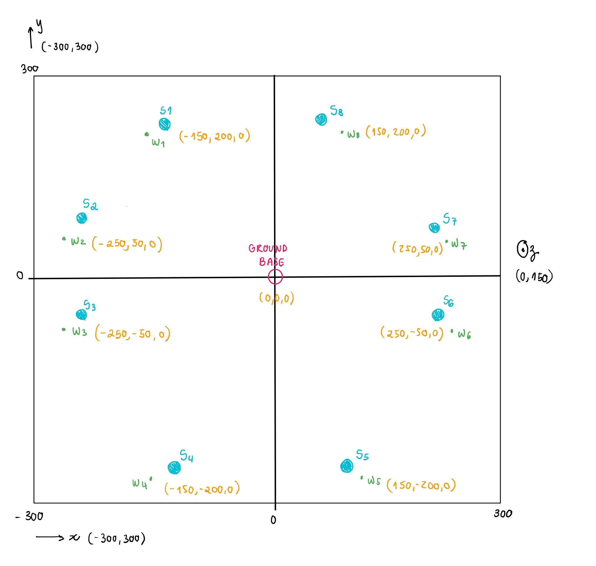

# Distributed Algorithm Consensus

The project's goal is to implement a distributed systems consensus algorithm for mobile wireless sensor networks.

- **Framework:** [GrADyS SIM Next Gen](https://project-gradys.github.io/gradys-sim-nextgen/)
- **Language:** Python 3.10

The visualization handler for GrADyS SIM is [here](https://project-gradys.github.io/gradys-sim-nextgen-visualization/).

## Introducing the System Model

We have **n** sensors spread around a location, which collect information of interest about the environment. Because this location has no communication infrastructure, we will use a UAV swarm that will fly autonomously to the deployment location. They will receive data from the sensors through local communication and fly back to the central ground station where data will be off-loaded and analysed.

### Sensor Protocol

A sensor has a fixed position and is continuously collecting data from the deployment environment.

1) Periodically, it creates a packet containing this information and stores it locally.
2) It keeps listening to any UAV messages. When it makes contact with one, it responds to that UAV by sending every packet it has stored.

### Ground Station Protocol

A ground station has a fixed position and serves as a home base for the UAV swarm.

1) It listens to any UAV communication and stores the received packets.
2) Responds to the UAV sender that their packets were received.

### UAV Protocol

An UAV (un-manned aerial vehicle) continuously flies between the ground station and the sensors in the deployment location.

1) Periodically, it tries to communicate with nearby agents, to advertise the number of packets it contains.
2) Stores packets received from sensors and there is no limit to how many packets it can carry.
3) Drops packets after uploading them in the ground station.

### Consensus Protocol

The challenge here is to implement a consensus protocol for determining which UAV will leave the swarm in order to collect data from a sensor. We will implement a known consensus algorithm and the value for decision will be the closest UAV to the sensor, i.e. UAV smallest in distance from sensor.

## Development Steps

By using the GrADyS SIM Next Gen framework, the following development steps will be taken:

1) We will have to map where in the deployment location the sensors and the ground station will be placed.

2) We will need a mobility protocol for the UAVs to move in a swarm. A known Mission Mobility Plugin will be used in order to infer waypoints in the deployment location, which the UAVs will have to follow, walking close to the sensors and, in the end, forming a roundtrip path from the Ground Station.

3) We will implement a consensus protocol for the UAVs to decide which one of them will break from the swarm and mission, in order to retrieve data from the sensors.

For this, we will need a request-reponse messaging system that falls within one of the categories below:

1) UAV-and-UAV: Will be exchaged between UAVs only and used to form the consensus.
2) UAV-and-Ground-Station: Will serve to enable the packet dump from the UAVs to the ground station.
3) Sensor-and-UAV: Will serve to transfer packets between a sensor and a UAV.

An example of what the network may look like is as follows. The UAVs would follow a counter clockwise path, starting from the ground base at `(0,0,0)`, passing through each waypoint `w1` to `w8`, collecting data from all the sensors `S1` to `S8`, and finishing back at the ground base.

### Results

Check the `videos` folder for examples of simulations. Each simulation's corresponding log is available at the root files `logs-nodes3.dur60.txt` and `logs-nodes6.dur60.txt`.